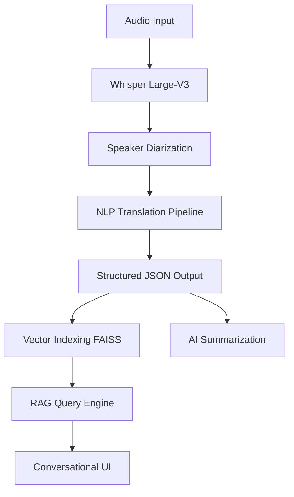

# TRANSCRIPT.AI 🎙️🌐
### Industry-Ready Conversational Transcription System

A production-grade, AI-powered system that combines state-of-the-art speech recognition, NLP pipelines, and Retrieval-Augmented Generation (RAG) to transform audio into actionable intelligence.

---

## 🚀 System Architecture



## 🎯 Key Features

### 1. Core AI Pipeline
*   **Speech-to-Text**: Powered by OpenAI Whisper (Large-V3) for human-level accuracy in 100+ languages.
*   **Speaker Diarization**: Integrated Pyannote 3.1 for precise speaker identification and segmentation.
*   **Multilingual Support**: Automatic language detection and translation into English using Helsinki-NLP transformers.
*   **Audio Enhancement**: Optimized processing for noisy recordings and long-form audio.

### 2. Generative AI & RAG
*   **Conversational Querying**: Chat with your transcripts using a robust Retrieval-Augmented Generation pipeline.
*   **Intelligent Summarization**: Get high-level executive summaries of long conversations instantly.
*   **Vector Search**: Semantic search over transcript chunks using `sentence-transformers` and `FAISS`.
*   **Contextual Memory**: Maintain conversation state for complex follow-up questions about the audio.

### 3. Engineering & Deployment
*   **Scalable API**: Built with FastAPI featuring asynchronous request handling and background processing.
*   **Modern Frontend**: Premium Next.js interface with glassmorphism design and real-time progress tracking.
*   **Deployment Ready**: Fully Dockerized with multi-stage builds for backend and frontend.
*   **Production Standards**: Comprehensive logging, structured JSON responses, and environment-based configuration.

---

## 🛠️ Tech Stack

*   **Backend**: Python, FastAPI, Uvicorn
*   **Frontend**: Next.js, React, Tailwind CSS, Lucide
*   **AI/ML**: PyTorch, Transformers, OpenAI Whisper, FAISS
*   **LLM**: Ollama (Local) or OpenAI API compatible
*   **Infrastructure**: Docker, Docker Compose

---

## 🚦 Quick Start

### Prerequisites
*   Python 3.10+
*   Node.js 18+
*   FFmpeg installed on system
*   Ollama (for RAG features)

### 1. Install Dependencies
```bash
# Backend
pip install -r requirements.txt

# Frontend
cd frontend
npm install
```

### 2. Environment Setup
Create a `.env` file in the root:
```env
LOG_LEVEL=INFO
CORS_ORIGINS=http://localhost:3000
# If using Ollama
OLLAMA_BASE_URL=http://localhost:11434
```

### 3. Run the System
```bash
# Start Backend
python backend/api.py

# Start Frontend
cd frontend
npm run dev
```

---

## 📊 Deployment & Engineering Highlights

*   **Asynchronous Jobs**: Audio processing runs in background tasks with unique Job IDs.
*   **Vector Database**: Efficiently indexes transcription chunks for sub-second semantic retrieval.
*   **Modular Pipeline**: Easy to swap Whisper for Faster-Whisper or change the LLM generator.
*   **Responsive UI**: Optimized for all devices with a premium "Developer-First" aesthetic.

---

*Built for AI Engineers, GenAI Practitioners, and Applied ML Roles.*
